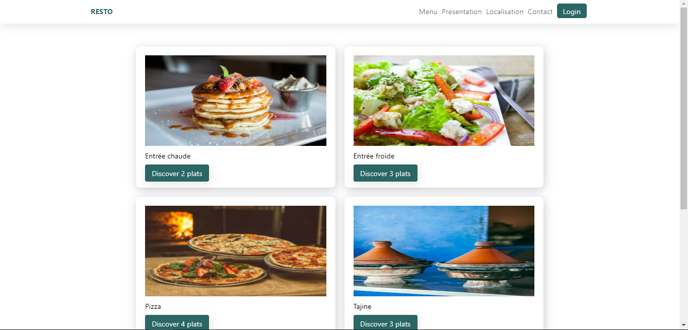
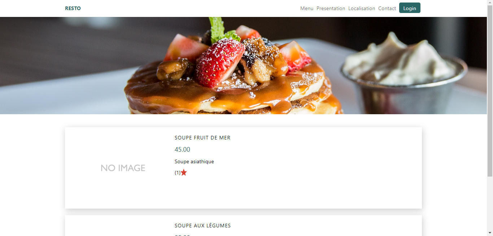

## Project looks like

 
    the project is a restaurant management system
 

## How to install it

<ul>
    <li>git clone https://github.com/coding-tea/restaurant_management.git</li>
    <li>composer install</li>
    <li>cp .env.example .env</li>
    <li>php artisan migrate:fresh --seed</li>
    <li>npm i</li>
    <li>npm run build</li>
    <li>npm run dev</li>
    <li>php artisan ser</li>
</ul>